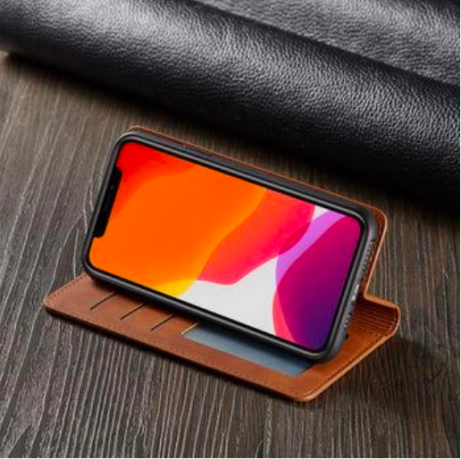

# 第二模块介绍

## 任务描述

请您阅读以下内容，按照要求完成以下手机壳创意文案设计任务。

您是苹果公司（iPhone）手机事业部的产品经理。目前，公司计划推出一款新的手机壳，你需要为该款手机壳创作广告文案。该广告将展示在抖音、小红书、微信朋友圈和微博等宣传平台上，考虑到用户在这些平台上的注意力持续时间较短，你需要尽可能地创作吸引眼球的创意文案。
以下是这款手机壳的产品详情：

**1. 产品名称：iPhone皮革翻盖手机壳**

**2. 产品详情与亮点**

- 材质方面：采用最优质的复古PU皮革和柔软TPU材质，具备无与伦比的强度和耐用性，清洁时只需用湿布擦拭灰尘和污垢即可。
- 外部设计方面：得益于创新设计，拥有内置支架和豪华卡夹口袋，提供360度全方位保护，边缘凸起确保相机和屏幕得到最大程度保护。防刮耐磨，告别指纹和划痕，内部柔软防滑衬里提供超强缓冲回弹，保护手机免受磨损。
- 支架功能方面：内置支架模式可实现免提观看视频或与朋友聊天，非常适合多任务处理。
- 兼容性方面：精准适配多种iPhone型号，可无障碍访问所有端口、控制按键和传感器。
- 价格：原价60元；促销价30元（五折），免运费。

**3.任务要求**

  请您考虑创意的新颖性和实用性，给出**200字**以上的创意方案。

- 内容新颖性：创作的广告文案内容要突出产品上述特点与优势，能够吸引消费者购买。
- 创意实用性：文案展示位置需适应抖音、小红书、微信朋友圈和微博这些社交平台的展示特点，在短时间内吸引用户注意力。

根据以上信息，请您按照以下要求完成该任务。**任务的整体完成时间为20分钟，分为“创意产生”和“创意细化”两个阶段完成。**
## 
<NavButton 
  buttonText="开始限时任务！" 
  to="/second_B1"
  align="center"
/>